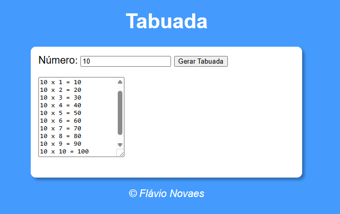

# 🧮 Tabuada

Projeto simples desenvolvido em **HTML, CSS e JavaScript**, que permite gerar automaticamente a **tabuada** de um número informado pelo usuário, exibindo os resultados de forma dinâmica na tela.

Este projeto foi desenvolvido com base nas aulas do Curso em Vídeo, ministradas por Gustavo Guanabara, como parte dos estudos iniciais em JavaScript.


---

##🖼️ Preview do Projeto

###🔢 Tabuada Gerada


## 🚀 Funcionalidades
- Permite inserir um número para gerar a tabuada
- Gera automaticamente a tabuada de 0 a 10
- Exibe os resultados dinamicamente na tela
- Validação de campo vazio com mensagem de aviso
- Interface simples e funcional

---

## 🛠️ Tecnologias Utilizadas
- **HTML5**
- **CSS3**
- **JavaScript**

---

## 📂 Estrutura do Projeto
```text
📁 Tabuada
├── tabuada.html
├── style.css
├── script.js
```
---

## ▶️ Como Executar o Projeto
1. Faça o download ou clone este repositório:
```bash
git clone https://github.com/FlavioNovaes/Tabuada.git
```
2. Abra o arquivo index.html diretamente no navegador

---

📚 Aprendizados

Com o desenvolvimento deste projeto, foi possível praticar e compreender melhor:

- Estrutura de repetição while no JavaScript
- Uso de condições (if, else) para validação de dados
- Manipulação do DOM para exibir resultados dinâmicos
- Conversão de tipos com Number()
- Construção de strings com template literals
- Lógica para geração de tabuadas
- Integração entre HTML, CSS e JavaScript
